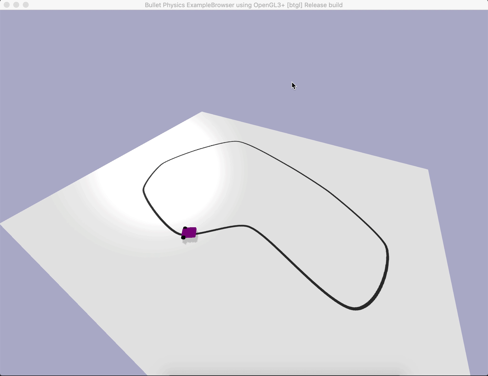
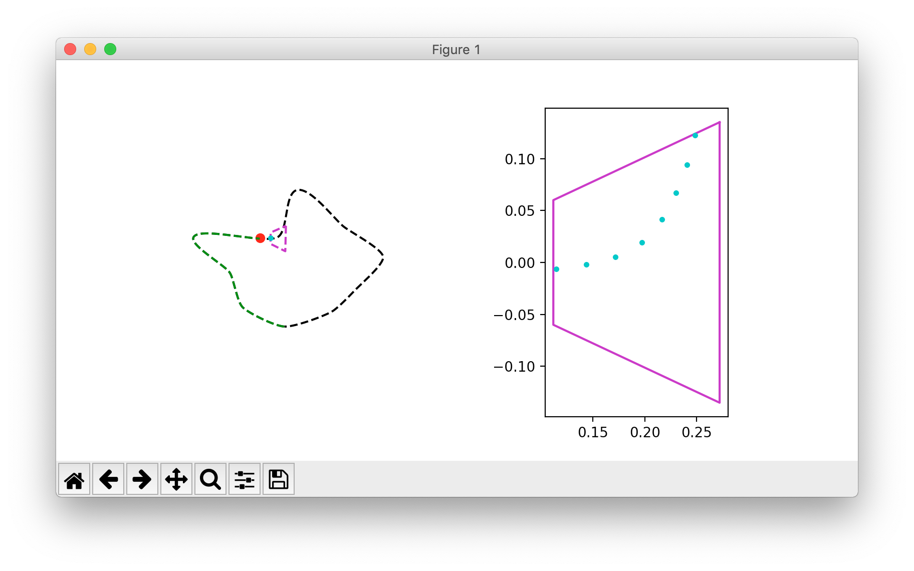
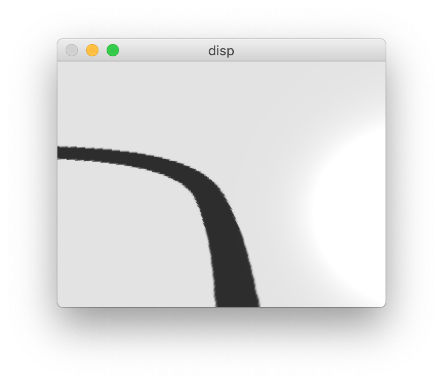
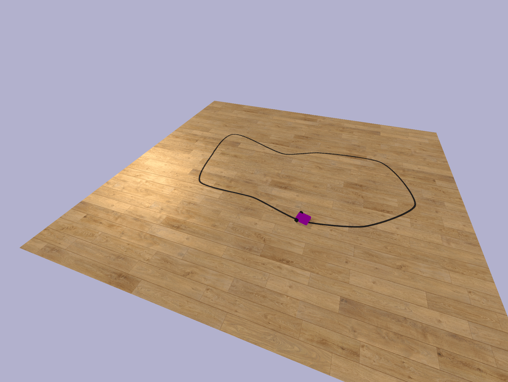

# Gym-Line-Follower

Line follower robot simulator for OpenAI Gym.



## Introduction
Gym-Line-Follower is a simulator for a line following robot.
It is designed for developing line following algorithms using 
reinforcement learning. The simulator is written in Python and uses Pybullet engine for accurate
physics simulation. Gym-Line-Follower is fast and customizable. It currently supports differential
drive robots.

Observation can either be a point sequence representing line in front of the robot
or a robot point of view camera image.


Left: Track with progress marked green, Right: Camera field of view (magenta) with line representation
 points (cyan).

---

This simulator was created as a part of masters thesis at 
[Faculty of Mechanical Engineering, University of Ljubljana](https://www.fs.uni-lj.si/).


## Installation
Requirements:
- Python 3.5+
- OpenAI Gym
- NumPy
- Shapely
- Pybullet
- OpenCV

```
git clone https://github.com/nplan/gym-line-follower.git
pip3 install -e gym-line-follower
```
> Requirements will be installed automatically. By using ````-e```` the environment is
installed in place and is editable.

You must run `import gym_line_follwer` before `import gym`. This adds the environment to gym registry and makes it available to `gym.make()`.

Requirements for execution of examples:
- Keras 2.3.1
- Tensorflow 1.14
- Keras-RL 0.4.2

```
pip install keras==2.3.1 tensorflow==1.14 keras-rl
```

## Usage
Load the environment as usual.
``` python
import gym
env = gym.make("LineFollower-v0")
```

 ## Environments
 ### LineFollower-v0
 Line follower is placed at the beginning of a closed loop track. The objective is to follow the track as quickly
 and accurately as possible. Progress is measured in percent of track driven. Episode finishes when the track
 is completed (whole loop driven), when the follower gets to far from the track or when the follower moves in the 
 wrong track direction for some distance.
 
 **Randomization:**
 Line track is generated randomly at the start of each episode
 and the starting angle of follower bot relative to the track direction is sampled from interval *(-0.2, 0.2) rad*.
 Other parameters are fixed and are specified in files ```bot_config.json``` and ```follower_bot.urdf```.
 
 **Observation Space:**
 *Box(16)* - 8 points with *(x, y)* coordinates representing line, arranged in order x1, y1, x2, y2, ... 
 Origin of the coordinate system is robots
 center of rotation. *x* in range *(0, 0.3)*, *y* in range *(-0.2, 0.2)*.
 
 **Action Space:**
 *Box(2)* - 2 values representing left and right motor power in range *(-1, 1)*.
 
 **Reward:**
 Track is split in 500 checkpoints that must be reached for the episode to complete successfully.
 When a checkpoint is reached, a reward is calculated using the following equations:
 ```
 checkpoint_reward = 1000. / nb_checkpoints
 track_error_norm = track_err * (1.0 / max_track_error)
 reward = checkpoint_reward * (1.0 - track_error_norm) ** 2
 ```
 Where ```nb_checkpoints``` is number of track checkpoints (500), ```track_error``` is distance between follower bot 
 center of rotation and the closes point on track, ```max_track_error``` is maximum allowed *track_error*.
 
 At each step a value of 0.2 is subtracted from reward to encourage quick completion of the track.
 
 If the episode finishes before the track is complete, a reward of -100 is given.
 
 ### LineFollowerCamera-v0
 Same as *LineFollower-v0* except observation is a rendered image from forward facing camera, 
 returned as an RGB image array shape (240, 320, 3), type uint8.
 
 
 ## Customized environments
 Custom environments can be built quickly by making the environment
 using the class constructor with arguments.
 
 ``` python
 from gym_line_follower.envs import LineFollowerEnv
 env = LineFollowerEnv(gui=False, nb_cam_pts=8, max_track_err=0.3, speed_limit=0.2,
                       max_time=100, randomize=True, obsv_type="latch")
 ```
 > Description of arguments is provided in source code.
 
 ## Configuration and Randomization

 The simulator can be configured with parameters inside the file ```bot_config.json```. Randomization at the beginning of
 each episode can be enabled for each parameter. You must format the json file according to the following rules:
 
 >If value randomization at a key is desired, provided value must be a dict with entries:
 > - 'range': [a, b] - random uniform sample in range a, b
 > - 'choice': [a, b, c, d, ...] - random choice of one value from the list
 > - 'default': a - default value
 
 >   Default value must always be provided. One of keys 'range' or 'choice' must be provided.
 >   If value at key is not a dict no randomization is performed.
 
 Randomization is enabled with the ```randomize``` parameter.
 
 >*WARNING*: Randomization is not yet working to the full extent. Some parameters are still hardcoded
 inside the file ```follower_bot.urdf```. The code to dynamically build this file from parameters inside 
 ```bot_config.json``` will be added in the future.
 

 ## Render options
 - ```"human"``` - display a live *matplotlib* plot with 2D representation of line track and representation points.
 
 
 - ```"rgb_array"``` - same as *"human"* but return an RGB image array instead of displaying plot.  
 
 - ```"pov"``` - return an RGB image array from a forward facing point-of-view camera.
    
    >NOTE: Virtual camera position and viewing angle is currently hardcoded to match camera window parameters in 
    ```bot_config.json```. This will be improved in the future.

 - ```"gui"``` - make the *pybullet* GUI run at real-time FPS.
 
 ## Track rendering randomization
 Track can be rendered with different colors and background (floor) textures. This is not enabled by
 default. Desired parameters can be set in ```track_render_config.json``` file, which must be formatted in the same 
 way as described in *Configuration and Randomization* section. 
 
 
 
 Track rendering randomization
 can be enabled as following:
 ``` python
 render_params = RandomizerDict(json.load(open("track_render_config.json", "r")))
 env = LineFollowerEnv(track_render_params=render_params)
 ```
 
 >This feature can be used in combination with ```"pov"``` render mode for automatic generation of labeled image data, 
 that can be used for training a line detector neural network.
 
 ## Example - DDPG
 The environment was used to train an agent using DDPG algorithm. The agent learns to precisely follow the line after 100k      steps. Training code and trained models are available in the ```examples``` folder. The agent performance after increasing numbers of training steps can be seen in the following video.
 
<a href="https://youtu.be/Z6u6SXMQQC8"><a/>
